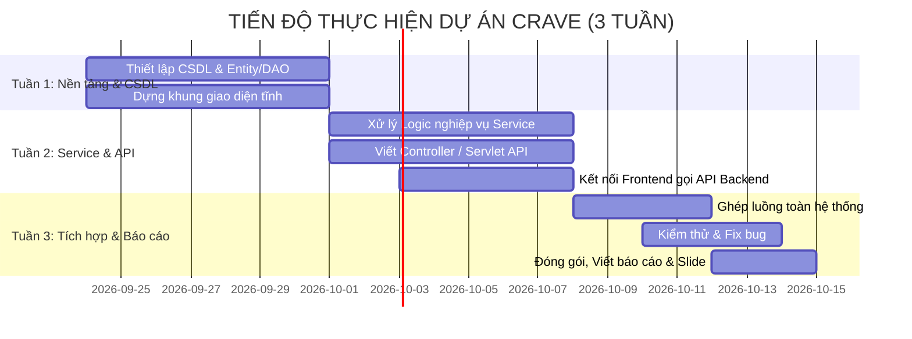

# KẾ HOẠCH PHÂN CHIA NHIỆM VỤ DỰ ÁN (3 TUẦN)
## HỆ THỐNG ĐẶT MÓN ĂN TRỰC TUYẾN CRAVE (CRAVE FOOD & BEVERAGE)

> **Mục tiêu dự án:** Xây dựng hệ thống đặt món trực tuyến hoàn chỉnh gồm cả **Frontend** (Giao diện người dùng) và **Backend** (Java Servlet + JPA/Hibernate + HikariCP + MySQL).  
> **Quy mô nhóm:** 4 thành viên.  
> **Thời gian thực hiện:** 3 tuần.

---

## 1. Danh sách 4 Thành viên & Module phụ trách

| STT | Họ và tên | Nhánh Git phụ trách | Module phụ trách chính |
|:---:|:---|:---|:---|
| 1 | **Ung Văn Trí** | `feature/food-category` | **Module Thực đơn & Danh mục (Foods & Categories)** |
| 2 | **Nguyễn Quang Vinh** | `feature/auth-user` | **Module Xác thực, Phân quyền & Khách hàng (Auth & Users)** |
| 3 | **Nguyễn Minh Huân** | `feature/cart-checkout` | **Module Giỏ hàng, Khuyến mãi & Thanh toán (Cart & Checkout)** |
| 4 | **Nguyễn Đức Phát** | `feature/order-management` | **Module Xử lý Đơn hàng, Theo dõi & Thống kê (Orders & Tracking)** |

---

## 2. Kế hoạch chi tiết theo từng tuần (3 Tuần)

---

### TUẦN 1: THIẾT LẬP NỀN TẢNG, TẦNG CSDL (JPA/DAO) & GIAO DIỆN TĨNH

* **Mục tiêu chung Tuần 1:**
  - Cả nhóm chạy file `database/QuanLyDatDoAn.sql` trên máy cá nhân để có sẵn dữ liệu test.
  - Tạo xong các Entity JPA và các lớp DAO cơ bản thao tác CSDL.
  - Dựng xong khung layout giao diện tĩnh (HTML/CSS/TSX) cho các trang phụ trách.

#### Phân công công việc Tuần 1:

1. **Ung Văn Trí** (`feature/food-category`):
   - **Backend:**
     - Tạo Entity: `DanhMuc.java`, `MonAn.java`, `TuyChonMon.java`.
     - Tạo DAO: `DanhMucDAO.java`, `MonAnDAO.java` (lấy danh sách danh mục, món ăn, tìm kiếm món theo tên).
   - **Frontend:**
     - Thiết kế giao diện trang Danh sách món ăn (`pages/food`): Thanh tìm kiếm, thanh lọc theo danh mục, thẻ hiển thị món ăn.

2. **Nguyễn Quang Vinh** (`feature/auth-user`):
   - **Backend:**
     - Tạo Entity: `KhachHang.java`, `NhanVien.java`, `DiaChiGiaoHang.java`.
     - Tạo DAO: `KhachHangDAO.java`, `NhanVienDAO.java`, `DiaChiGiaoHangDAO.java`.
     - Tiện ích bảo mật: Viết `PasswordUtil` mã hóa mật khẩu bằng BCrypt.
   - **Frontend:**
     - Thiết kế giao diện trang Đăng nhập (`pages/login`) và Đăng ký (`pages/register`).
     - Thiết kế form nhập thông tin hồ sơ cá nhân (`pages/profile`).

3. **Nguyễn Minh Huân** (`feature/cart-checkout`):
   - **Backend:**
     - Tạo Entity: `GioHang.java`, `ChiTietGioHang.java`, `KhuyenMai.java`.
     - Tạo DAO: `GioHangDAO.java`, `ChiTietGioHangDAO.java`, `KhuyenMaiDAO.java`.
   - **Frontend:**
     - Thiết kế giao diện Giỏ hàng (`pages/cart`): Danh sách món đã chọn, nút tăng giảm số lượng, ô nhập mã giảm giá.
     - Thiết kế giao diện Đặt hàng (`pages/checkout`): Lựa chọn hình thức nhận hàng (Giao tận nơi / Tự đến lấy), chọn phương thức thanh toán.

4. **Nguyễn Đức Phát** (`feature/order-management`):
   - **Backend:**
     - Tạo Entity: `DonHang.java`, `ChiTietDonHang.java`, `LichSuTrangThaiDonHang.java`.
     - Tạo DAO: `DonHangDAO.java`, `ChiTietDonHangDAO.java`, `LichSuTrangThaiDonHangDAO.java`.
     - Kiểm tra hoạt động của trigger `TRG_ChiTietDonHang_TinhLaiTongTien` trong MySQL.
   - **Frontend:**
     - Thiết kế giao diện Theo dõi đơn hàng (`pages/tracking`): Hiển thị tiến trình đơn hàng (Chờ xác nhận -> Đang chuẩn bị -> Đang giao -> Hoàn tất).
     - Thiết kế trang Lịch sử các đơn đã đặt.

---

### TUẦN 2: XÂY DỰNG TẦNG SERVICE, CONTROLLER/SERVLET & KẾT NỐI API FRONTEND

* **Mục tiêu chung Tuần 2:**
  - Viết logic xử lý nghiệp vụ tại tầng Service.
  - Hoàn thiện các Controller / Servlet để nhận HTTP Request và trả về JSON chuẩn `ApiResponse<T>`.
  - Frontend dùng `fetch` hoặc `axios` gọi API từ backend và hiển thị dữ liệu thật lên giao diện.

#### Phân công công việc Tuần 2:

1. **Ung Văn Trí** (`feature/food-category`):
   - **Backend:**
     - Viết `FoodService` & `CategoryService`: Validate giá bán > 0, kiểm tra món còn bán hay hết hàng.
     - Viết `FoodController` / `FoodServlet`: API `GET /api/foods`, `GET /api/foods/{id}`, `GET /api/categories`.
   - **Frontend:**
     - Đấu nối API lấy danh mục và danh sách món ăn từ Backend vào trang `pages/food` và `pages/home`.

2. **Nguyễn Quang Vinh** (`feature/auth-user`):
   - **Backend:**
     - Viết `AuthService` & `UserService`: Xử lý đăng ký tài khoản mới, kiểm tra trùng số điện thoại/email, kiểm tra đăng nhập đúng mật khẩu.
     - Viết `AuthController` / `AuthServlet`: API `POST /api/auth/register`, `POST /api/auth/login`, `POST /api/auth/logout`.
     - Cấu hình `CorsFilter` để Frontend gọi không bị lỗi CORS, cấu hình `AuthFilter` bảo vệ các API cần đăng nhập.
   - **Frontend:**
     - Đấu nối form Đăng nhập và Đăng ký gọi API Backend, lưu trạng thái đăng nhập vào `localStorage` hoặc Session.

3. **Nguyễn Minh Huân** (`feature/cart-checkout`):
   - **Backend:**
     - Viết `CartService`: Thêm món vào giỏ, cập nhật số lượng, xóa món, tính tổng tiền tạm tính.
     - Viết `VoucherService`: Kiểm tra mã giảm giá còn hạn sử dụng, tính tiền được giảm theo phần trăm hoặc tiền mặt.
     - Viết `CartController`: API `GET /api/cart`, `POST /api/cart/items`, `DELETE /api/cart/items/{id}`.
   - **Frontend:**
     - Xử lý hành động bấm "Thêm vào giỏ" từ trang món ăn, hiển thị cập nhật giỏ hàng theo thời gian thực.
     - Xử lý nhập mã khuyến mãi và trừ tiền trực tiếp trên trang Checkout.

4. **Nguyễn Đức Phát** (`feature/order-management`):
   - **Backend:**
     - Viết `OrderService`: Tạo đơn hàng từ giỏ hàng (sử dụng Transaction quản lý tạo `DonHang`, copy sang `ChiTietDonHang` và xóa `GioHang`).
     - Viết API cập nhật trạng thái đơn hàng (`ChoXacNhan` -> `DangChuanBi` -> `DangGiao` -> `HoanTat` / `DaHuy`) và tự động ghi log vào `LichSuTrangThaiDonHang`.
     - Viết `OrderController`: API `POST /api/orders/checkout`, `GET /api/orders`, `GET /api/orders/{id}`, `PUT /api/orders/{id}/status`.
   - **Frontend:**
     - Đấu nối nút "Đặt ngay", gửi dữ liệu đơn hàng về Backend.
     - Nhận mã đơn và chuyển hướng sang trang `pages/tracking` để xem trạng thái đơn hàng thời gian thực.

---

### TUẦN 3: TÍCH HỢP TOÀN DIỆN, KIỂM THỬ (TESTING), TỐI ƯU & NỘP BÀI

* **Mục tiêu chung Tuần 3:**
  - Ghép nối toàn bộ luồng hoạt động từ đầu đến cuối (End-to-End).
  - Kiểm tra và sửa lỗi phát sinh (CORS, lỗi font tiếng Việt UTF-8, lỗi tính toán tiền, xử lý ngoại lệ).
  - Hợp nhất tất cả các nhánh `feature/*` vào `develop` và tạo bản phát hành cuối cùng trên `main`.
  - Chuẩn bị slide thuyết trình và tài liệu báo cáo dự án.

#### Phân công công việc Tuần 3:

1. **Cả 4 thành viên phối hợp:**
   - **Kiểm thử luồng mua hàng trọn vẹn (End-to-End Test):**
     1. Khách hàng vào trang chủ xem danh mục & món ăn.
     2. Đăng ký tài khoản mới -> Đăng nhập vào hệ thống.
     3. Chọn món kèm tùy chọn (Size, Topping) -> Thêm vào giỏ hàng.
     4. Mở giỏ hàng -> Nhập mã khuyến mãi (`FIRSTBITE`, `KM01`...).
     5. Điền thông tin giao hàng & chọn phương thức thanh toán -> Bấm Đặt hàng.
     6. Chuyển sang màn hình Theo dõi đơn hàng và xem lịch sử trạng thái cập nhật.
   - **Xử lý các tình huống lỗi (Edge Cases):**
     - Đặt hàng khi giỏ hàng rỗng.
     - Đăng ký trùng số điện thoại đã có trong CSDL.
     - Nhập mã giảm giá đã hết hạn.

2. **Phụ trách chốt mã nguồn & Tài liệu:**
   - **Nguyễn Quang Vinh (Trưởng nhóm):**
     - Review các Pull Request từ nhánh `feature/*` vào `develop`.
     - Kiểm tra xung đột code, merge bản ổn định từ `develop` vào nhánh `main`.
     - Viết tài liệu tổng kết kiến trúc hệ thống và hướng dẫn cài đặt.
   - **Ung Văn Trí & Nguyễn Minh Huân:**
     - Rà soát giao diện toàn bộ các trang trên cả màn hình máy tính và điện thoại (Responsive UI).
     - Chuẩn hóa toàn bộ thông báo lỗi trả về từ Backend dưới dạng tiếng Việt thân thiện.
   - **Nguyễn Đức Phát:**
     - Tổng hợp số liệu dữ liệu mẫu (Seed data), kiểm tra tính toàn vẹn của CSDL sau khi chạy thử nghiệm.
     - Soạn thảo Slide thuyết trình demo sản phẩm cho nhóm.

---

## 3. Tiêu chí đánh giá hoàn thành nhiệm vụ (Checklist)

- [ ] Code tuân thủ đúng kiến trúc phân tầng (JPA Entity -> DAO/Repository -> Service -> Controller/Servlet -> Frontend).
- [ ] Mọi commit đều tuân thủ quy tắc trong [QUY_LUAT_COMMIT.md](QUY_LUAT_COMMIT.md).
- [ ] Không có commit rác (`node_modules`, `target`, file `.class`).
- [ ] Không push code trực tiếp lên nhánh `main` và `develop`.
- [ ] Toàn bộ các API đều có trả về định dạng chuẩn `ApiResponse`.
