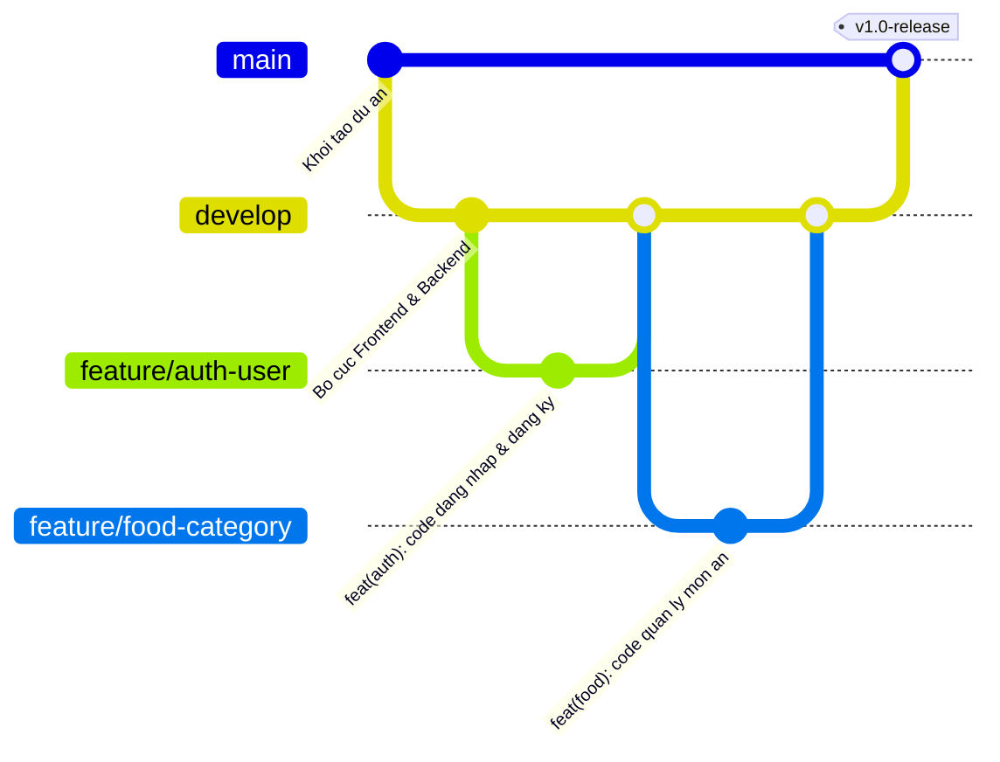

# QUY TẮC COMMIT & QUẢN LÝ GIT (PROJECT CRAVE)

Tài liệu này quy định chuẩn quản lý mã nguồn, chiến lược phân nhánh Git Flow, quy tắc đặt tên nhánh, cú pháp viết commit message và quy trình Pull Request (PR) cho nhóm 4 thành viên.

---

## 1. Chiến lược phân nhánh (Branching Strategy)

Dự án áp dụng mô hình phân nhánh chuẩn **Git Flow**:



### Các nhánh cố định:
- **`main`**: Nhánh chứa mã nguồn chính thức, ổn định nhất để nộp bài hoặc báo cáo với giảng viên. **Tuyệt đối không commit trực tiếp vào nhánh `main`**.
- **`develop`**: Nhánh làm việc chung và tích hợp mã nguồn của cả 4 thành viên. Các nhánh tính năng khi hoàn thành sẽ tạo Pull Request merge vào `develop`.

### Các nhánh tính năng của 4 thành viên:
| Tên nhánh Git | Thành viên phụ trách | Module đảm nhận |
|:---|:---|:---|
| **`feature/food-category`** | **Ung Văn Trí** | Module Thực đơn & Danh mục (Foods & Categories) |
| **`feature/auth-user`** | **Nguyễn Quang Vinh** | Module Xác thực, Phân quyền & Tài khoản (Auth & Users) |
| **`feature/cart-checkout`** | **Nguyễn Minh Huân** | Module Giỏ hàng, Khuyến mãi & Đặt món (Cart & Checkout) |
| **`feature/order-management`** | **Nguyễn Đức Phát** | Module Quản lý đơn hàng, Trạng thái & Thống kê (Orders & Analytics) |

---

## 2. Quy tắc đặt tên nhánh (Branch Naming Convention)

Khi cần tạo nhánh mới (feature, fix bug...), đặt tên theo cấu trúc:

```text
feature/<ten-tinh-nang-ngan-gon>
bugfix/<loi-can-sua>
hotfix/<loi-nghiem-trong-can-sua-gap>
```

**Ví dụ:**
- `feature/auth-user`
- `feature/food-search`
- `bugfix/cart-total-calculation`
- `hotfix/cors-origin-blocked`

---

## 3. Cú pháp viết Commit (Conventional Commits)

Mỗi lần commit phải viết theo chuẩn quốc tế:

```text
<type>(<scope>): <mo ta ngan gon ve thay doi>
```

> **Khuyến nghị quan trọng:** Viết mô tả commit bằng **tiếng Việt KHÔNG DẤU** (hoặc tiếng Anh) để tránh lỗi font ký tự lạ trên Terminal Windows/PowerShell và giao diện GitHub.

### Bảng các loại commit (`type`):

| Loại (`type`) | Ý nghĩa | Khi nào dùng? | Ví dụ commit chuẩn |
|:---|:---|:---|:---|
| **`feat`** | Tính năng mới | Thêm mới Servlet, Service, DAO, Controller, trang giao diện | `feat(auth): them chuc nang dang ky tai khoan` |
| **`fix`** | Sửa lỗi | Sửa bug logic, sửa lỗi truy vấn CSDL, sửa lỗi hiển thị | `fix(cart): sua loi tinh sai tong tien khi them topping` |
| **`docs`** | Tài liệu | Cập nhật README, file phân công, quy tắc commit | `docs(git): cap nhat quy tac commit cho nhom` |
| **`style`** | Định dạng / CSS | Chỉnh sửa CSS, căn lề HTML/JSP, không đổi logic code | `style(home): can chinh lai hero banner va font chu` |
| **`refactor`**| Tái cấu trúc code | Viết lại code gọn hơn, tối ưu hàm mà không thêm tính năng | `refactor(dao): toi uu cau lenh sql truy van mon an` |
| **`test`** | Kiểm thử | Viết unit test hoặc code test thử nghiệm kết nối DB | `test(db): kiem tra ket noi den co so du lieu MySQL` |
| **`chore`** | Cấu hình dự án | Sửa `pom.xml`, `package.json`, `.gitignore` | `chore(pom): bo sung dependency hibernate-hikaricp` |

### Ví dụ các commit hợp lệ:
- `feat(food): tao giao dien danh sach mon an va bo loc danh muc`
- `feat(auth): viet API dang nhap va ma hoa mat khau BCrypt`
- `fix(order): sua loi trigger khong cap nhat lai tong tien`
- `style(checkout): chinh sua giao dien form nhap dia chi nhan hang`
- `refactor(service): tach service interface va service impl`

---

## 4. Quy trình làm việc và đẩy code hàng ngày

```bash
# 1. Chuyen sang nhanh cua minh truoc khi lam viec
git checkout feature/auth-user

# 2. Keo code moi nhat tu nhanh develop ve de dong bo
git pull origin develop

# 3. Sau khi viet code hoac sua xong, kiem tra cac file thay doi
git status

# 4. Them file vao staging
git add .

# 5. Commit voi thong diep ro rang theo quy tac
git commit -m "feat(auth): hoan thanh API dang ky nguoi dung moi"

# 6. Day code len nhanh cua minh tren GitHub
git push -u origin feature/auth-user
```

---

## 5. Quy trình gộp nhánh (Pull Request & Code Review)

1. **Tuyệt đối không merge thẳng vào `main` hoặc `develop`**.
2. Khi hoàn thành một tính năng trên nhánh `feature/*`:
   - Lên GitHub tại địa chỉ: `https://github.com/nguyenvinhz/project_crave`
   - Nhấn **New Pull Request**.
   - Base branch chọn: `develop` <- Compare branch chọn: `feature/...` của bạn.
   - Ghi mô tả những gì đã làm, đính kèm ảnh chụp màn hình (nếu là giao diện).
   - Nhờ ít nhất **1 thành viên khác trong nhóm review**, kiểm tra không xung đột (conflict) rồi mới tiến hành **Merge Pull Request**.
